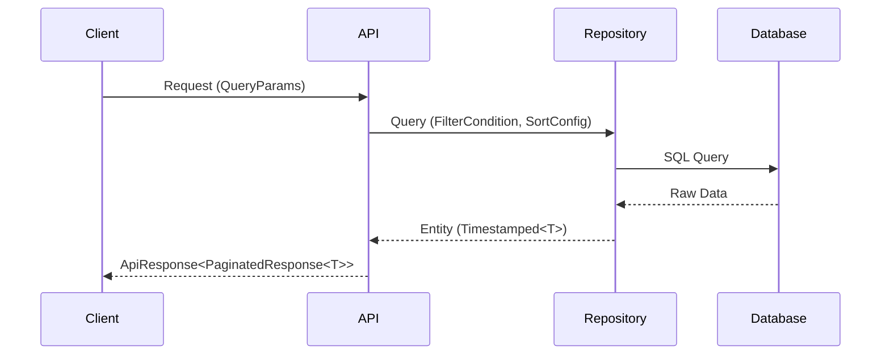
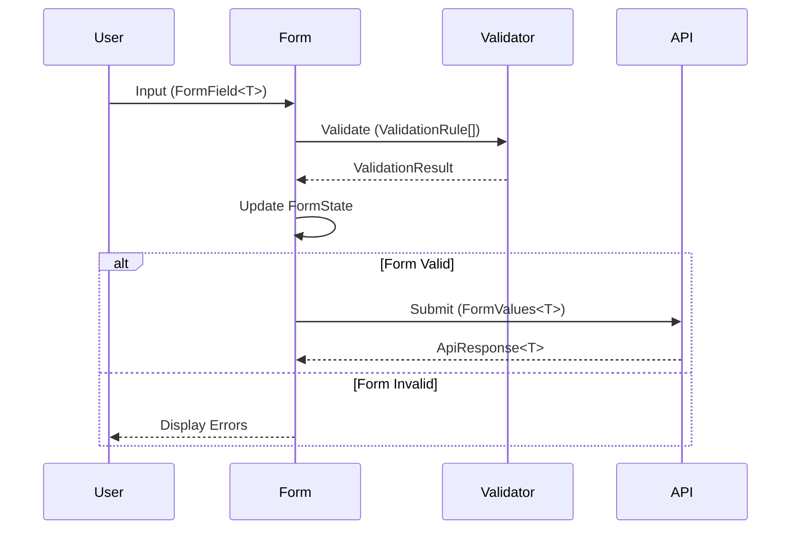
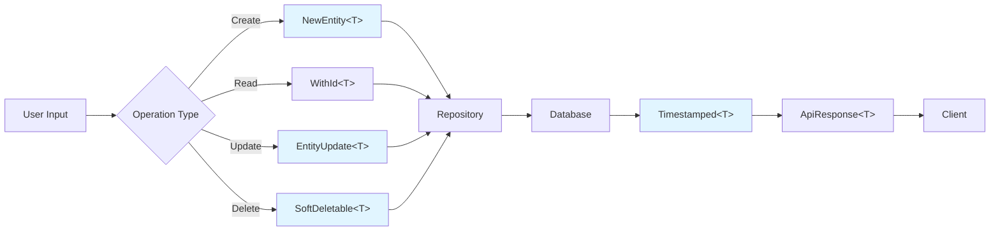

# Type System Architecture

## 📐 Type Hierarchy and Relationships

```mermaid
graph TB
    subgraph "Utility Types (Foundation)"
        UT[utility.types.ts]
        UT --> Nullable
        UT --> Optional
        UT --> DeepPartial
        UT --> Timestamped
        UT --> WithId
        UT --> Brand
        UT --> Result
        UT --> QueryParams
    end

    subgraph "Common Types (Domain)"
        CT[common.types.ts]
        CT --> ContactInfo
        CT --> Address
        CT --> Money
        CT --> AuditMetadata
        CT --> Status[Status Enums]
        Timestamped -.uses.-> AuditMetadata
    end

    subgraph "API Types (Communication)"
        AT[api.types.ts]
        AT --> ApiResponse
        AT --> ApiError
        AT --> PaginatedResponse
        AT --> HttpStatusCode
        Result -.pattern.-> ApiResponse
    end

    subgraph "Form Types (UI State)"
        FT[form.types.ts]
        FT --> FormField
        FT --> FormState
        FT --> ValidationRule
        FT --> FormWizard
    end

    subgraph "Application Layer"
        API[API Routes]
        REPO[Repositories]
        FORMS[Form Components]
        UI[UI Components]
    end

    AT --> API
    UT --> REPO
    FT --> FORMS
    CT --> UI
    CT --> API
    CT --> FORMS

    classDef foundation fill:#e1f5ff,stroke:#0066cc,stroke-width:2px
    classDef domain fill:#fff4e6,stroke:#ff9800,stroke-width:2px
    classDef communication fill:#f3e5f5,stroke:#9c27b0,stroke-width:2px
    classDef uistate fill:#e8f5e9,stroke:#4caf50,stroke-width:2px
    classDef app fill:#fce4ec,stroke:#e91e63,stroke-width:2px

    class UT,Nullable,Optional,DeepPartial,Timestamped,WithId,Brand,Result,QueryParams foundation
    class CT,ContactInfo,Address,Money,AuditMetadata,Status domain
    class AT,ApiResponse,ApiError,PaginatedResponse,HttpStatusCode communication
    class FT,FormField,FormState,ValidationRule,FormWizard uistate
    class API,REPO,FORMS,UI app
```



## 🔄 Type Flow Patterns

### Pattern 1: API Request/Response Flow



### Pattern 2: Form Validation Flow



### Pattern 3: Database CRUD Operations



## 🏗️ Type Composition Examples

### Example 1: Building a Complete Entity

```typescript
// Start with base entity
interface Owner {
  firstName: string
  lastName: string
  email: string
  phone: string
}

// Add ID
type OwnerWithId = WithId<Owner>
// Result: Owner & { id: number }

// Add timestamps
type OwnerEntity = Timestamped<OwnerWithId>
// Result: Owner & { id: number; createdAt: Date; updatedAt: Date }

// For soft delete support
type DeletableOwner = SoftDeletable<OwnerEntity>
// Result: OwnerEntity & { deletedAt?: Date; deletedBy?: number }

// For new owner creation
type NewOwner = NewEntity<OwnerEntity>
// Result: Omit<OwnerEntity, 'id' | 'createdAt' | 'updatedAt'>

// For owner updates
type UpdateOwner = EntityUpdate<OwnerEntity>
// Result: Partial<Omit<OwnerEntity, 'id' | 'createdAt' | 'updatedAt'>>
```

### Example 2: API Response Construction

```typescript
// Single resource
type OwnerResponse = ApiResponse<Owner>

// Paginated list
type OwnerListResponse = ApiResponse<PaginatedResponse<Owner>>

// With cursor pagination
type OwnerCursorResponse = ApiResponse<CursorPaginatedResponse<Owner>>

// Error response
type OwnerErrorResponse = ApiErrorResponse
```

### Example 3: Form State Management

```typescript
interface LoginData {
  email: string
  password: string
}

// Complete form state
type LoginFormState = FormState<LoginData>

// Single field
type EmailField = FormField<string>

// Validation schema
type LoginValidation = ValidationSchema<LoginData>

// Form values
type LoginValues = FormValues<LoginData>

// Form errors
type LoginErrors = FormErrors<LoginData>
```

## 🎨 Type Organization Matrix

| Category | Purpose | Depends On | Used By |
|----------|---------|------------|---------|
| **utility.types** | Generic type utilities | None | All other types |
| **common.types** | Domain-specific types | utility.types | api, form types |
| **api.types** | API communication | utility.types | API routes, hooks |
| **form.types** | Form management | utility.types | Form components |

## 🔑 Key Type Relationships

### Inheritance Chains

1. **Entity Evolution**
   ```
   Base Interface → WithId → Timestamped → Auditable → SoftDeletable
   ```

2. **Partial Variants**
   ```
   Full Type → Optional → DeepPartial → RecursivePartial
   ```

3. **Response Wrappers**
   ```
   T → Result<T> → ApiResponse<T> → PaginatedResponse<T>
   ```

### Type Guards and Narrowing

```typescript
// Type guard for API responses
function isSuccessResponse<T>(
  response: ApiResponse<T>
): response is ApiSuccessResponse<T> {
  return response.success === true
}

// Type guard for Result pattern
function isSuccess<T>(result: Result<T>): result is Success<T> {
  return result.success === true
}
```

## 📚 Import Patterns

### Recommended Import Style

```typescript
// ✅ Good: Import from index
import { ApiResponse, FormState, Owner } from '@/lib/types'

// ✅ Good: Import specific category
import type { ValidationRule, FormField } from '@/lib/types/form.types'

// ⚠️ Acceptable: Import from specific file for clarity
import { HttpStatusCode, ApiErrorCode } from '@/lib/types/api.types'

// ❌ Bad: Relative imports from outside types directory
import { ApiResponse } from '../../../lib/types/api.types'
```

### Type-Only Imports (Performance)

```typescript
// Use 'type' keyword for type-only imports
import type { ApiResponse, Owner, Pet } from '@/lib/types'

// This prevents unnecessary runtime code
import { type FormState, validateEmail } from '@/lib/types'
```

## 🎯 Type Selection Guide

Use this guide to choose the right type for your use case:

| Use Case | Recommended Type | File |
|----------|-----------------|------|
| API endpoint response | `ApiResponse<T>` | api.types |
| Paginated list endpoint | `PaginatedResponse<T>` | api.types |
| Error handling | `Result<T>` or `ApiError` | utility/api |
| Form state | `FormState<T>` | form.types |
| Form field | `FormField<T>` | form.types |
| New database record | `NewEntity<T>` | utility.types |
| Update database record | `EntityUpdate<T>` | utility.types |
| Nullable fields | `Nullable<T>` | utility.types |
| Optional fields | `Optional<T>` | utility.types |
| Deep partial update | `DeepPartial<T>` | utility.types |
| Contact information | `ContactInfo` | common.types |
| Address | `Address` | common.types |
| Money/Currency | `Money` | common.types |
| Type-safe IDs | `OwnerId`, `PetId`, etc. | utility.types |
| Audit tracking | `AuditMetadata` | common.types |
| Query parameters | `QueryParams` | utility.types |
| Filtering | `FilterCondition` | utility.types |
| Sorting | `SortConfig` | utility.types |

## 🔮 Extension Points

The type system is designed for easy extension:

1. **Add new branded IDs**: Add to utility.types
2. **Add new status types**: Add to common.types
3. **Add new error codes**: Add to `ApiErrorCode` enum
4. **Add new validation rules**: Add to `ValidationRuleType`
5. **Add new form patterns**: Extend form.types

---

*This architecture provides a solid foundation for type-safe development across the entire Vetrix application.*
